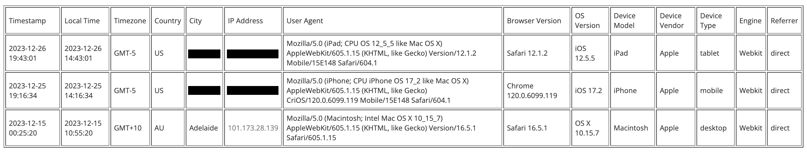

# Device Details

A plugin to display information about each click, based on Tacoded's IP Click Details.  
Requires Your Own URL Shortener ([YOURLS](https://yourls.org)) `v1.9.2` and above.

## Usage

This plugin uses WhichBrowser's Parser to display IP, user-agent, device, browser, location, and time.

## Installation

1. First install WhichBrowser using `composer require whichbrowser/parser`.
2. In `/user/plugins`, create a new folder named `device-details`.
3. Download this git repo and drop the files in that directory.
4. Go to the Plugins admin page (eg. `http://sho.rt/admin/plugins.php`) and activate it.

## License

This package is licensed under the [MIT License](LICENSE.txt).
