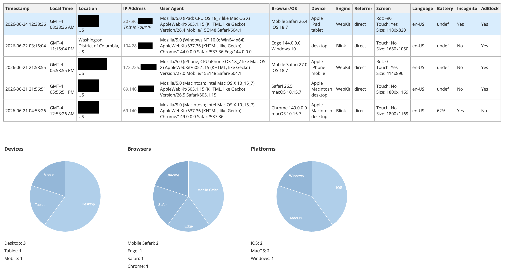

# Device Details 

This plugin was originally based on Tacoded's now-delted IP Click Details.  
Developed for Your Own URL Shortener ([YOURLS](https://yourls.org)) `v1.9.2` and above.

## Demonstration

Check it out on my own website: [yourls-device-details.dreamhosters.com](https://yourls-device-details.dreamhosters.com/).  
I use the Sleeky theme, but the default works, although the table columns may get smushed.

## Usage

Please make sure that you are following all local privacy laws while using this plugin.

### Version 1
This version uses WhichBrowser to parse the user-agent for device and browser information.  
It also fetches the location of the click and local time based off of the IP address.  
The information is displayed in a table in the stats page of each link below the click count graph.  
If you really want to use this version, please check out the relevant installation instructions.  
All relevant files are in the `version1` folder, anything else is for the most recent version (see below).

### Version 2
This version contains everything in version 1, but also tracks many more stats for device fingerprinting.  
Things like device battery, orientation, language, and screen info can be collected with some Javascript.  
However, it is no longer available (i.e. removed from this repository) because it [hacked core files](https://yourls.org/docs/development/dont-hack-core).  
Additionally, the way the data was transferred from the browser meant that it was always one click behind.

### Version 3
This version tracks everything from version 3, but does it does so without hacking core files.  
Namely, the normal logging is skipped and the client side information is sent to yourls_log via AJAX.  
I cannot take credit for this, as it was [Loganathan](https://github.com/logusivam) who gave me the reference code.  
It still has all of the functionality of version 2, and some newly added features as well.  
Firstly, the WhichBrowser dependency has been removed since it was confusing for users.  
The plugin now uses UAParser.js and some custom regex matching to display the same information.  
The incognito detection has been improved thanks to Joe12387, and adblock detection is more accurate.  
There is a dedicated settings page where you can input your own [ipinfo.io](https://ipinfo.io) API token.   
This page is also where you must input your signature token to allow for passwordless API calls.   
Lastly, there are charts that breakdown the devices, platforms, and browsers for all the clicks.   
This feature was inspired by [another plugin](https://github.com/AlbertoVargasMoreno/YOURLS-Device-Charts) that was actually inspired from this plugin.
Note that if JavaScript is not enabled in the browser, then the click may be missed.   

## Installation
1. In `/user/plugins`, create a new folder named `device-details`.
2. Download the `plugin.php`, `incognito.js`, and `uaparser.js` files from this repository.
3. Add all three files into the newly created directory.
4. Go to the Plugins admin page (eg. `http://sho.rt/admin/plugins.php`) and activate it.
5. Even if the admin area is private, you can make the link stats page public.
   - Do this by adding `define('YOURLS_PRIVATE_INFOS', false);` to `config.php`.

Alternatively, version 3 of this plugin is compatible with both [Download Plugins](https://github.com/krissss/yourls-download-plugin) and [Download Delete](https://github.com/SachinSAgrawal/YOURLS-Download-Delete), so copy and paste the URL of this repository and set the branch to be `main` to install it.

## Contributors
Sachin Agrawal: I'm a self-taught programmer who knows many languages and I'm into app, game, and web development. For more information, check out my website or Github profile. If you would like to contact me, my email is [github@sachin.email](mailto:github@sachin.email).

## License
This package is licensed under the [MIT License](LICENSE.txt).